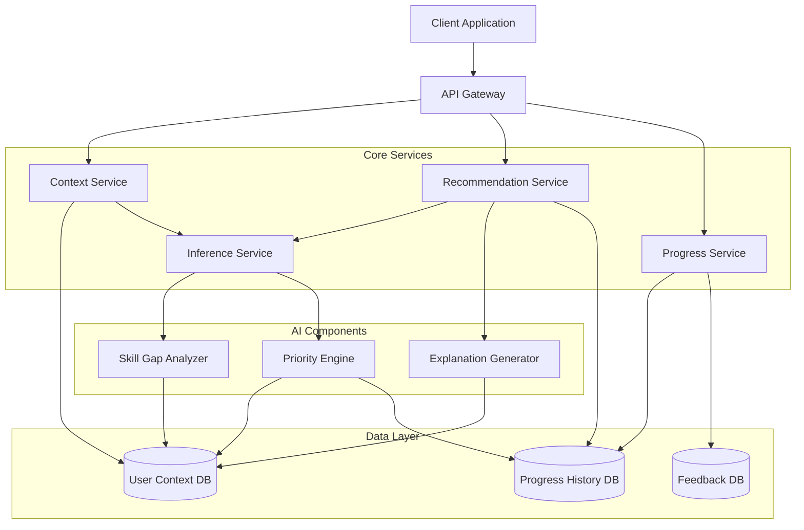
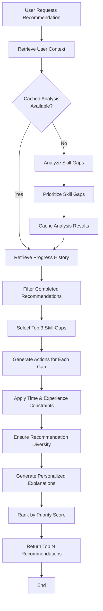

# Design Document: AI-Powered Learning and Productivity Copilot

## Overview

The AI-powered learning and productivity copilot is designed as a context-aware recommendation system that helps early-career developers and engineering students make efficient learning decisions. The system continuously ingests user context (goals, skills, constraints), infers skill gaps using AI, and generates personalized, adaptive recommendations with clear explanations.

The architecture follows a modular design with clear separation between:
- **Input Layer**: Captures structured and unstructured user context
- **AI Inference Layer**: Analyzes context to identify skill gaps and priorities
- **Recommendation Engine**: Generates actionable next steps with explanations
- **Data Layer**: Persists user context, progress, and feedback
- **API Layer**: Exposes functionality to client applications

This design prioritizes explainability, adaptability, and scalability while maintaining realistic implementation complexity suitable for an MVP.

## Architecture

### High-Level Architecture



### Component Responsibilities

**API Gateway**
- Routes client requests to appropriate services
- Handles authentication and authorization
- Implements rate limiting and request validation
- Returns standardized response formats

**Context Service**
- Manages user context intake (structured and unstructured input)
- Validates user input against defined schemas
- Triggers context updates and re-analysis
- Persists Learning_Context to storage

**Inference Service**
- Orchestrates AI components for skill gap analysis
- Coordinates with Priority Engine to rank skill gaps
- Provides skill gap data to Recommendation Service
- Caches inference results for performance

**Recommendation Service**
- Generates personalized recommendations based on skill gaps
- Coordinates with Explanation Generator for context-aware explanations
- Filters recommendations based on user constraints (time, experience level)
- Ensures recommendation diversity

**Progress Service**
- Records completed actions and user feedback
- Retrieves progress history for analysis
- Provides progress data to Inference Service for adaptation
- Implements deduplication to prevent repeated recommendations

**Skill Gap Analyzer (AI Component)**
- Analyzes user goals and current skills to identify gaps
- Uses semantic understanding to map goals to required skills
- Distinguishes between foundational and advanced skill gaps
- Outputs prioritized list of skill gaps with confidence scores

**Priority Engine (AI Component)**
- Ranks skill gaps based on goal relevance, urgency, and dependencies
- Considers user constraints (time availability, experience level)
- Adapts priorities based on progress history and feedback
- Implements learning path sequencing logic

**Explanation Generator (AI Component)**
- Generates context-aware explanations for recommendations
- Tailors explanation complexity to user experience level
- Connects recommendations to specific user goals and challenges
- Avoids generic explanations through personalization

### Technology Stack Considerations

**AI/ML Components**:
- Large Language Model (LLM) for natural language understanding and generation (e.g., GPT-4, Claude, or open-source alternatives)
- Embedding models for semantic similarity (e.g., sentence-transformers)
- Vector database for skill and goal matching (e.g., Pinecone, Weaviate, or FAISS)

**Backend**:
- API framework: FastAPI (Python) or Express (Node.js)
- Database: PostgreSQL for structured data, MongoDB for flexible schema
- Caching: Redis for inference result caching
- Message queue: RabbitMQ or AWS SQS for async processing

**Deployment**:
- Containerization: Docker
- Orchestration: Kubernetes or AWS ECS
- Cloud provider: AWS, GCP, or Azure (with India region support)

## Components and Interfaces

### Context Service Interface

```typescript
interface ContextService {
  // Create or update user context
  updateContext(userId: string, context: UserContextInput): Promise<UserContext>
  
  // Retrieve current user context
  getContext(userId: string): Promise<UserContext>
  
  // Validate context input
  validateContext(context: UserContextInput): ValidationResult
  
  // Trigger re-analysis after context update
  triggerReanalysis(userId: string): Promise<void>
}

interface UserContextInput {
  roleGoals?: string[]           // e.g., ["Backend Developer", "DevOps Engineer"]
  experienceLevel?: ExperienceLevel
  timeAvailability?: number      // hours per week
  challenges?: string            // unstructured text
  interests?: string             // unstructured text
}

enum ExperienceLevel {
  BEGINNER = "beginner",
  INTERMEDIATE = "intermediate",
  ADVANCED = "advanced"
}

interface UserContext {
  userId: string
  roleGoals: string[]
  experienceLevel: ExperienceLevel
  timeAvailability: number
  challenges: string
  interests: string
  createdAt: Date
  updatedAt: Date
}
```

### Inference Service Interface

```typescript
interface InferenceService {
  // Analyze user context to identify skill gaps
  analyzeSkillGaps(userId: string): Promise<SkillGapAnalysis>
  
  // Get prioritized skill gaps
  getPrioritizedGaps(userId: string): Promise<PrioritizedSkillGap[]>
  
  // Refresh analysis based on new progress
  refreshAnalysis(userId: string, progressUpdate: ProgressRecord): Promise<void>
}

interface SkillGapAnalysis {
  userId: string
  skillGaps: SkillGap[]
  analyzedAt: Date
  confidenceScore: number
}

interface SkillGap {
  skillName: string
  category: string              // e.g., "Programming Language", "Framework", "Tool"
  currentLevel: number          // 0-10 scale
  targetLevel: number           // 0-10 scale
  gapSize: number              // targetLevel - currentLevel
  relatedGoals: string[]       // which user goals require this skill
  foundational: boolean        // is this a prerequisite for other skills?
}

interface PrioritizedSkillGap extends SkillGap {
  priority: number             // 1 (highest) to N (lowest)
  reasoning: string            // why this priority was assigned
}
```

### Recommendation Service Interface

```typescript
interface RecommendationService {
  // Generate recommendations for a user
  generateRecommendations(userId: string, count?: number): Promise<Recommendation[]>
  
  // Get a single next-best recommendation
  getNextRecommendation(userId: string): Promise<Recommendation>
  
  // Refresh recommendations after context or progress update
  refreshRecommendations(userId: string): Promise<void>
}

interface Recommendation {
  recommendationId: string
  userId: string
  action: Action
  explanation: Explanation
  priority: number
  estimatedTimeMinutes: number
  skillGapsAddressed: string[]  // skill names this recommendation helps with
  createdAt: Date
}

interface Action {
  type: ActionType
  title: string
  description: string
  resourceUrl?: string
  resourceType?: ResourceType
}

enum ActionType {
  LEARN_CONCEPT = "learn_concept",
  PRACTICE_EXERCISE = "practice_exercise",
  BUILD_PROJECT = "build_project",
  READ_DOCUMENTATION = "read_documentation",
  WATCH_TUTORIAL = "watch_tutorial"
}

enum ResourceType {
  TUTORIAL = "tutorial",
  DOCUMENTATION = "documentation",
  COURSE = "course",
  ARTICLE = "article",
  VIDEO = "video",
  CODING_CHALLENGE = "coding_challenge"
}

interface Explanation {
  why: string                   // why this recommendation is relevant
  howItHelps: string           // how it addresses skill gaps
  nextSteps: string            // what comes after this
  tailoredTo: ExperienceLevel  // explanation complexity level
}
```

### Progress Service Interface

```typescript
interface ProgressService {
  // Record completion of a recommendation
  recordCompletion(userId: string, recommendationId: string, feedback?: Feedback): Promise<ProgressRecord>
  
  // Get progress history
  getProgressHistory(userId: string, limit?: number): Promise<ProgressRecord[]>
  
  // Submit feedback on a recommendation
  submitFeedback(userId: string, recommendationId: string, feedback: Feedback): Promise<void>
  
  // Check if a recommendation was already completed
  isCompleted(userId: string, recommendationId: string): Promise<boolean>
}

interface ProgressRecord {
  recordId: string
  userId: string
  recommendationId: string
  completedAt: Date
  feedback?: Feedback
}

interface Feedback {
  rating: FeedbackRating
  comment?: string
}

enum FeedbackRating {
  HELPFUL = "helpful",
  NOT_HELPFUL = "not_helpful",
  IRRELEVANT = "irrelevant"
}
```

## Data Models

### User Context Schema

```typescript
{
  userId: string (primary key)
  roleGoals: string[]
  experienceLevel: "beginner" | "intermediate" | "advanced"
  timeAvailability: number  // hours per week
  challenges: string        // unstructured text
  interests: string         // unstructured text
  createdAt: timestamp
  updatedAt: timestamp
}
```

### Skill Gap Schema

```typescript
{
  gapId: string (primary key)
  userId: string (foreign key)
  skillName: string
  category: string
  currentLevel: number
  targetLevel: number
  gapSize: number
  relatedGoals: string[]
  foundational: boolean
  priority: number
  reasoning: string
  analyzedAt: timestamp
}
```

### Recommendation Schema

```typescript
{
  recommendationId: string (primary key)
  userId: string (foreign key)
  actionType: string
  actionTitle: string
  actionDescription: string
  resourceUrl: string (nullable)
  resourceType: string (nullable)
  explanationWhy: string
  explanationHowItHelps: string
  explanationNextSteps: string
  priority: number
  estimatedTimeMinutes: number
  skillGapsAddressed: string[]
  createdAt: timestamp
}
```

### Progress Record Schema

```typescript
{
  recordId: string (primary key)
  userId: string (foreign key)
  recommendationId: string (foreign key)
  completedAt: timestamp
  feedbackRating: string (nullable)
  feedbackComment: string (nullable)
}
```

## AI Components Design

### Skill Gap Analyzer

**Purpose**: Identify the difference between user's current skills and skills needed for their goals.

**Approach**:
1. **Goal Decomposition**: Use LLM to decompose user role goals into required skills
   - Input: User's role goals (e.g., "Backend Developer")
   - Output: List of required skills with target proficiency levels
   - Example: "Backend Developer" → ["Python (8/10)", "REST APIs (7/10)", "Databases (7/10)", "Git (6/10)"]

2. **Current Skill Assessment**: Infer current skill level from user context
   - Use experience level as baseline (beginner=2/10, intermediate=5/10, advanced=8/10)
   - Adjust based on unstructured input (challenges, interests)
   - Use semantic similarity to match mentioned skills to skill taxonomy

3. **Gap Calculation**: Compute difference between target and current levels
   - For each required skill, calculate: gapSize = targetLevel - currentLevel
   - Mark skills with gapSize > 0 as skill gaps
   - Identify foundational skills (prerequisites for other skills)

**Implementation Strategy**:
- Use LLM with structured prompts for goal decomposition
- Maintain a skill taxonomy/ontology for consistent skill naming
- Use embeddings for semantic matching of user-mentioned skills
- Cache goal decomposition results for common roles

**Example Prompt for Goal Decomposition**:
```
Given the role goal: "Backend Developer"
And experience level: "beginner"

List the top 10 skills required for this role with target proficiency levels (0-10 scale).
Format: {"skillName": "Python", "category": "Programming Language", "targetLevel": 8, "foundational": true}
```

### Priority Engine

**Purpose**: Rank skill gaps to determine which should be addressed first.

**Ranking Factors**:
1. **Foundational Priority**: Foundational skills get higher priority (multiplier: 1.5x)
2. **Gap Size**: Larger gaps get higher priority (weight: 0.3)
3. **Goal Relevance**: Skills related to more goals get higher priority (weight: 0.3)
4. **Time Fit**: Skills learnable within user's time availability get boosted (weight: 0.2)
5. **Progress History**: Skills with recent progress get lower priority to encourage diversity (weight: 0.2)

**Priority Score Formula**:
```
priorityScore = (foundationalMultiplier) * (
  (gapSize * 0.3) +
  (goalRelevanceCount * 0.3) +
  (timeFitScore * 0.2) +
  (diversityScore * 0.2)
)
```

**Adaptation Logic**:
- When user completes a recommendation, reduce priority of related skill gaps
- When user provides negative feedback, reduce priority of similar recommendations
- When user updates goals, recalculate all priorities
- Implement decay function: older skill gaps gradually increase in priority if not addressed

**Implementation Strategy**:
- Compute priority scores for all skill gaps
- Sort by priority score (descending)
- Re-compute priorities when progress or context changes
- Cache priority rankings with TTL (time-to-live) of 1 hour

### Explanation Generator

**Purpose**: Create context-aware explanations that help users understand why a recommendation matters.

**Explanation Components**:
1. **Why**: Connect recommendation to user's specific goals and challenges
2. **How It Helps**: Explain which skill gaps this addresses
3. **Next Steps**: Preview what comes after completing this recommendation

**Personalization Strategy**:
- **For Beginners**: Use simple language, provide more context, include analogies
- **For Intermediate**: Balance detail and brevity, assume some background knowledge
- **For Advanced**: Use technical terminology, focus on nuances and trade-offs

**Example Explanations**:

*Beginner Level*:
```
Why: You mentioned wanting to become a Backend Developer. Python is the foundation 
for backend development and is beginner-friendly.

How It Helps: Learning Python basics will help you understand how to write server-side 
code, which is essential for building APIs and handling data.

Next Steps: After learning Python basics, you'll be ready to explore web frameworks 
like Flask or Django.
```

*Advanced Level*:
```
Why: Your goal of becoming a Backend Developer requires strong Python proficiency. 
Given your intermediate experience, focusing on advanced Python patterns will accelerate 
your progress.

How It Helps: Mastering decorators, context managers, and async/await will enable you 
to write production-grade backend code and understand modern Python frameworks.

Next Steps: You'll be positioned to dive into FastAPI or Django REST Framework with 
a solid understanding of the underlying patterns.
```

**Implementation Strategy**:
- Use LLM with structured prompts that include user context
- Template-based generation with dynamic variable substitution
- Include user's specific goals and challenges in the prompt
- Adjust prompt complexity based on experience level

**Example Prompt for Explanation Generation**:
```
User Context:
- Goals: Backend Developer
- Experience: Beginner
- Challenges: "I don't know where to start with web development"
- Time: 10 hours/week

Recommendation: Learn Python basics (tutorial)

Generate an explanation with three parts:
1. Why this recommendation is relevant to the user's goals and challenges
2. How it helps address their skill gaps
3. What they should do next after completing this

Use simple, encouraging language appropriate for a beginner.
```

## Decision-Making Logic

### Recommendation Generation Flow



### Constraint Application Logic

**Time Availability Constraint**:
```python
def apply_time_constraint(recommendations, time_available_hours):
    """Filter recommendations that fit within user's time availability"""
    time_available_minutes = time_available_hours * 60
    
    # Categorize recommendations by estimated time
    quick_wins = [r for r in recommendations if r.estimatedTimeMinutes <= 60]
    medium_tasks = [r for r in recommendations if 60 < r.estimatedTimeMinutes <= 180]
    long_tasks = [r for r in recommendations if r.estimatedTimeMinutes > 180]
    
    # Prioritize based on available time
    if time_available_minutes < 120:  # Less than 2 hours/week
        return quick_wins[:3]
    elif time_available_minutes < 300:  # 2-5 hours/week
        return quick_wins[:2] + medium_tasks[:1]
    else:  # 5+ hours/week
        return quick_wins[:1] + medium_tasks[:1] + long_tasks[:1]
```

**Experience Level Constraint**:
```python
def apply_experience_constraint(actions, experience_level):
    """Filter actions appropriate for user's experience level"""
    if experience_level == "beginner":
        # Prioritize tutorials, guided exercises, foundational concepts
        return [a for a in actions if a.resourceType in ["tutorial", "course"]]
    
    elif experience_level == "intermediate":
        # Balance learning and practice
        return [a for a in actions if a.resourceType in ["tutorial", "article", "coding_challenge"]]
    
    else:  # advanced
        # Prioritize advanced resources and projects
        return [a for a in actions if a.resourceType in ["documentation", "article", "coding_challenge"]]
```

### Diversity Enforcement Logic

```python
def ensure_diversity(recommendations, progress_history):
    """Ensure variety in recommendation types"""
    recent_types = [p.actionType for p in progress_history[-5:]]  # Last 5 actions
    
    # Count recent action types
    type_counts = {}
    for action_type in recent_types:
        type_counts[action_type] = type_counts.get(action_type, 0) + 1
    
    # Penalize recommendations of over-represented types
    diversified = []
    for rec in recommendations:
        penalty = type_counts.get(rec.action.type, 0) * 0.2
        rec.priority = rec.priority * (1 - penalty)
        diversified.append(rec)
    
    # Re-sort by adjusted priority
    return sorted(diversified, key=lambda r: r.priority, reverse=True)
```

### Adaptation Logic

**After Progress Update**:
1. Retrieve the completed recommendation
2. Identify skill gaps addressed by that recommendation
3. Reduce gap size for those skills (e.g., increase currentLevel by 1)
4. Re-prioritize remaining skill gaps
5. Invalidate cached recommendations
6. If feedback is negative, reduce priority of similar recommendations

**After Context Update**:
1. Clear cached skill gap analysis
2. Trigger new skill gap analysis
3. Re-prioritize all skill gaps
4. Invalidate cached recommendations
5. Notify user that recommendations will be refreshed

**Feedback Integration**:
```python
def integrate_feedback(feedback, recommendation, user_context):
    """Adjust future recommendations based on feedback"""
    if feedback.rating == "not_helpful":
        # Reduce priority of similar action types
        similar_penalty = 0.3
        
    elif feedback.rating == "irrelevant":
        # Strongly reduce priority of similar skill gaps
        similar_penalty = 0.5
        
    else:  # helpful
        # Boost priority of similar recommendations
        similar_penalty = -0.2  # negative penalty = boost
    
    # Apply penalty to future recommendations
    # (stored in user preferences for future generation)
    update_user_preferences(user_context.userId, {
        "action_type_penalty": {recommendation.action.type: similar_penalty}
    })
```


## Correctness Properties

*A property is a characteristic or behavior that should hold true across all valid executions of a system—essentially, a formal statement about what the system should do. Properties serve as the bridge between human-readable specifications and machine-verifiable correctness guarantees.*

### Property 1: Context Data Round-Trip Integrity

*For any* valid user context (including role goals, experience level, time availability, challenges, and interests), storing the context and then retrieving it should produce an equivalent context with all fields preserved.

**Validates: Requirements 1.1, 1.2, 8.1, 8.3, 8.5**

### Property 2: Input Validation Enforcement

*For any* user input containing invalid values (invalid experience level, negative time availability, or invalid feedback rating), the system should reject the input and return an error message specifying which field is invalid.

**Validates: Requirements 1.3, 1.4, 1.5, 6.1, 10.2, 10.4**

### Property 3: Skill Gap Goal Association

*For any* user context with stated role goals, all identified skill gaps should have a non-empty list of related goals, and each related goal should be one of the user's stated goals.

**Validates: Requirements 2.1, 2.4**

### Property 4: Skill Gap Prioritization Consistency

*For any* set of skill gaps for a user, the prioritized list should be ordered by priority score (highest to lowest), and foundational skills should have higher priority than non-foundational skills with similar gap sizes.

**Validates: Requirements 2.2, 2.3**

### Property 5: Progress-Driven Skill Gap Adaptation

*For any* user with identified skill gaps, recording progress on a recommendation that addresses a specific skill gap should result in either a reduced gap size for that skill or the skill gap being removed from future analyses.

**Validates: Requirements 2.5, 3.6**

### Property 6: Recommendation Data Completeness

*For any* generated recommendation, it should contain a non-empty action with a title and description, a non-empty explanation with why/howItHelps/nextSteps components, a positive estimated time, and a non-empty list of skill gaps addressed.

**Validates: Requirements 3.1, 3.2, 9.2, 9.3**

### Property 7: Time Constraint Compliance

*For any* user context with specified time availability, all generated recommendations should have estimated times that, when summed for a week's worth of recommendations, do not exceed the user's weekly time availability by more than 20%.

**Validates: Requirements 3.4, 7.2**

### Property 8: Experience-Appropriate Recommendations

*For any* user context with a specified experience level, all generated recommendations should have action types and resource types appropriate for that level (tutorials/courses for beginners, documentation/challenges for advanced users).

**Validates: Requirements 3.5**

### Property 9: Explanation Personalization by Experience Level

*For any* two users with identical goals but different experience levels (beginner vs. advanced), the explanations for similar recommendations should differ in complexity, with beginner explanations being longer and avoiding technical jargon, and advanced explanations being more concise and technical.

**Validates: Requirements 4.1, 4.2, 4.3**

### Property 10: Explanation Context Specificity

*For any* two users with different goals or challenges, the explanations for the same skill gap should differ and should contain references to each user's specific goals or challenges (no generic explanations).

**Validates: Requirements 4.4, 4.5**

### Property 11: Progress History Round-Trip Integrity

*For any* valid progress record (including recommendation ID, completion timestamp, and optional feedback), storing the record and then retrieving the progress history should include that record with all fields preserved.

**Validates: Requirements 5.1, 5.2, 8.2, 8.4, 8.5**

### Property 12: Progress History Chronological Ordering

*For any* user with multiple progress records created at different times, retrieving the progress history should return records ordered by timestamp (oldest to newest or newest to oldest consistently).

**Validates: Requirements 5.3, 5.5**

### Property 13: Completed Recommendation Deduplication

*For any* recommendation that has been marked as completed in progress history, that recommendation should not appear in subsequent recommendation lists for the same user.

**Validates: Requirements 5.4**

### Property 14: Feedback-Driven Priority Adjustment

*For any* recommendation that receives negative feedback (not helpful or irrelevant), future recommendations with similar action types or addressing similar skill gaps should have measurably lower priority scores compared to before the feedback was provided.

**Validates: Requirements 6.3, 6.4, 6.5**

### Property 15: Context Update Triggers Re-Analysis

*For any* user context update (role goals, time availability, or experience level), the system should invalidate cached skill gap analyses and generate different skill gaps or recommendations compared to before the update.

**Validates: Requirements 7.1, 7.2, 7.3, 7.5**

### Property 16: Progress History Preservation During Context Updates

*For any* user with existing progress history, updating the user's context (goals, experience level, or time availability) should not modify, delete, or reorder any existing progress records.

**Validates: Requirements 7.4**

### Property 17: Recommendation Type Diversity

*For any* set of recommendations generated for a user, the set should contain at least two different action types (e.g., not all tutorials, not all coding challenges) unless fewer than two recommendations are generated.

**Validates: Requirements 9.1, 9.5**

### Property 18: Adaptive Diversity After Repeated Type Completion

*For any* user who has completed three or more recommendations of the same action type, the next set of generated recommendations should have a lower proportion of that action type compared to the proportion before those completions.

**Validates: Requirements 9.4, 9.5**

### Property 19: Error Message Specificity for Invalid Input

*For any* user input that fails validation due to multiple invalid fields, the error message should identify all invalid fields and provide specific reasons for each validation failure.

**Validates: Requirements 10.2, 10.4**

## Error Handling

### Input Validation Errors

**Invalid Experience Level**:
- Error Code: `INVALID_EXPERIENCE_LEVEL`
- Message: "Experience level must be one of: beginner, intermediate, advanced. Received: {value}"
- HTTP Status: 400 Bad Request

**Invalid Time Availability**:
- Error Code: `INVALID_TIME_AVAILABILITY`
- Message: "Time availability must be a positive number representing hours per week. Received: {value}"
- HTTP Status: 400 Bad Request

**Missing Required Fields**:
- Error Code: `MISSING_REQUIRED_FIELDS`
- Message: "The following required fields are missing: {field_list}. Please provide: {field_descriptions}"
- HTTP Status: 400 Bad Request

**Invalid Feedback Rating**:
- Error Code: `INVALID_FEEDBACK_RATING`
- Message: "Feedback rating must be one of: helpful, not_helpful, irrelevant. Received: {value}"
- HTTP Status: 400 Bad Request

### AI Inference Errors

**Skill Gap Analysis Failure**:
- Error Code: `SKILL_GAP_ANALYSIS_FAILED`
- Message: "Unable to analyze skill gaps at this time. Please try again in a few moments."
- HTTP Status: 503 Service Unavailable
- Fallback: Return cached analysis if available, otherwise prompt user to provide more context

**Recommendation Generation Failure**:
- Error Code: `RECOMMENDATION_GENERATION_FAILED`
- Message: "Unable to generate recommendations at this time. Please try again in a few moments."
- HTTP Status: 503 Service Unavailable
- Fallback: Return previously generated recommendations if available

**Explanation Generation Failure**:
- Error Code: `EXPLANATION_GENERATION_FAILED`
- Message: "Recommendation generated but explanation unavailable. The recommendation is: {action_title}"
- HTTP Status: 206 Partial Content
- Fallback: Return recommendation with generic explanation template

### Data Persistence Errors

**Context Storage Failure**:
- Error Code: `CONTEXT_STORAGE_FAILED`
- Message: "Unable to save your context. Please try updating again."
- HTTP Status: 500 Internal Server Error
- Retry Strategy: Exponential backoff with 3 retry attempts

**Progress Recording Failure**:
- Error Code: `PROGRESS_RECORDING_FAILED`
- Message: "Unable to record your progress. Your completion will be retried automatically."
- HTTP Status: 500 Internal Server Error
- Retry Strategy: Queue for async retry, notify user of retry status

**Context Retrieval Failure**:
- Error Code: `CONTEXT_RETRIEVAL_FAILED`
- Message: "Unable to retrieve your learning context. Please try refreshing."
- HTTP Status: 500 Internal Server Error
- Fallback: Prompt user to re-enter context if retrieval fails after retries

### External Dependency Errors

**LLM API Unavailable**:
- Error Code: `LLM_SERVICE_UNAVAILABLE`
- Message: "AI service temporarily unavailable. Using cached recommendations."
- HTTP Status: 503 Service Unavailable
- Fallback: Return cached recommendations and skill gaps, disable new analysis

**Database Connection Failure**:
- Error Code: `DATABASE_CONNECTION_FAILED`
- Message: "Unable to connect to database. Please try again shortly."
- HTTP Status: 503 Service Unavailable
- Retry Strategy: Circuit breaker pattern with 30-second timeout

**Rate Limit Exceeded**:
- Error Code: `RATE_LIMIT_EXCEEDED`
- Message: "Too many requests. Please wait {seconds} seconds before trying again."
- HTTP Status: 429 Too Many Requests
- Retry Strategy: Return retry-after header with appropriate delay

### Error Handling Principles

1. **User-Friendly Messages**: All error messages should be clear and actionable for non-technical users
2. **Graceful Degradation**: System should provide fallback behavior when possible rather than complete failure
3. **Retry Logic**: Transient errors should trigger automatic retries with exponential backoff
4. **Error Logging**: All errors should be logged with context for debugging and monitoring
5. **Status Transparency**: Users should be informed about system status and expected resolution times

## Testing Strategy

### Overview

The testing strategy employs a dual approach combining property-based testing for universal correctness guarantees and unit testing for specific examples and edge cases. This comprehensive approach ensures both general correctness across all inputs and proper handling of known edge cases.

### Property-Based Testing

**Framework Selection**:
- **Python**: Use `hypothesis` library for property-based testing
- **TypeScript/JavaScript**: Use `fast-check` library for property-based testing

**Configuration**:
- Minimum 100 iterations per property test (due to randomization)
- Each property test must reference its design document property
- Tag format: `# Feature: ai-learning-copilot, Property {number}: {property_text}`

**Property Test Implementation Guidelines**:

1. **Data Generators**: Create generators for all domain objects
   - `UserContextGenerator`: Generates valid user contexts with random goals, experience levels, time availability
   - `SkillGapGenerator`: Generates skill gaps with random priorities and gap sizes
   - `RecommendationGenerator`: Generates recommendations with random actions and explanations
   - `ProgressRecordGenerator`: Generates progress records with random timestamps and feedback

2. **Property Test Structure**:
   ```python
   from hypothesis import given, strategies as st
   
   @given(user_context=user_context_generator())
   def test_property_1_context_round_trip(user_context):
       """
       Feature: ai-learning-copilot, Property 1: Context Data Round-Trip Integrity
       For any valid user context, storing and retrieving should preserve all fields.
       """
       # Store context
       stored_id = context_service.update_context(user_context.user_id, user_context)
       
       # Retrieve context
       retrieved_context = context_service.get_context(user_context.user_id)
       
       # Assert equivalence
       assert retrieved_context.role_goals == user_context.role_goals
       assert retrieved_context.experience_level == user_context.experience_level
       assert retrieved_context.time_availability == user_context.time_availability
       assert retrieved_context.challenges == user_context.challenges
       assert retrieved_context.interests == user_context.interests
   ```

3. **Edge Case Handling in Generators**:
   - Include boundary values (0 hours/week, 168 hours/week)
   - Include empty strings and very long strings
   - Include special characters in unstructured text
   - Include all enum values for experience level and feedback ratings

### Unit Testing

**Focus Areas**:
- Specific examples demonstrating correct behavior
- Edge cases and boundary conditions
- Error conditions and validation failures
- Integration points between components

**Unit Test Examples**:

1. **Context Validation**:
   ```python
   def test_invalid_experience_level_rejected():
       """Test that invalid experience levels are rejected with specific error"""
       context = UserContextInput(
           role_goals=["Backend Developer"],
           experience_level="expert",  # Invalid
           time_availability=10
       )
       
       result = context_service.validate_context(context)
       
       assert not result.is_valid
       assert "experience_level" in result.errors
       assert "beginner, intermediate, advanced" in result.errors["experience_level"]
   ```

2. **Skill Gap Prioritization**:
   ```python
   def test_foundational_skills_prioritized():
       """Test that foundational skills get higher priority"""
       gaps = [
           SkillGap(skill_name="Advanced Algorithms", foundational=False, gap_size=5),
           SkillGap(skill_name="Python Basics", foundational=True, gap_size=5)
       ]
       
       prioritized = priority_engine.prioritize_gaps(gaps)
       
       assert prioritized[0].skill_name == "Python Basics"
       assert prioritized[0].foundational == True
   ```

3. **Recommendation Deduplication**:
   ```python
   def test_completed_recommendations_not_repeated():
       """Test that completed recommendations don't appear again"""
       user_id = "user123"
       rec_id = "rec456"
       
       # Complete a recommendation
       progress_service.record_completion(user_id, rec_id)
       
       # Generate new recommendations
       new_recs = recommendation_service.generate_recommendations(user_id)
       
       # Assert completed recommendation not in new list
       assert all(rec.recommendation_id != rec_id for rec in new_recs)
   ```

4. **Error Handling**:
   ```python
   def test_missing_required_fields_error():
       """Test that missing required fields produce specific error messages"""
       incomplete_context = UserContextInput(
           role_goals=["Backend Developer"]
           # Missing experience_level and time_availability
       )
       
       result = context_service.validate_context(incomplete_context)
       
       assert not result.is_valid
       assert "experience_level" in result.errors
       assert "time_availability" in result.errors
   ```

### Integration Testing

**Test Scenarios**:

1. **End-to-End Recommendation Flow**:
   - Create user context → Analyze skill gaps → Generate recommendations → Record progress → Verify adaptation

2. **Context Update Flow**:
   - Create initial context → Generate recommendations → Update context → Verify new recommendations differ

3. **Feedback Integration Flow**:
   - Generate recommendations → Provide negative feedback → Generate new recommendations → Verify priority adjustment

4. **Data Persistence Flow**:
   - Create context and progress → Simulate session end → Retrieve data → Verify integrity

### Performance Testing

**Load Testing**:
- Test system with 100 concurrent users
- Verify recommendation generation completes within 3 seconds
- Verify progress history retrieval completes within 1 second

**Scalability Testing**:
- Test with 10,000 user contexts in database
- Verify query performance remains acceptable
- Test cache effectiveness under load

### AI Component Testing

**Skill Gap Analyzer Testing**:
- Test with known role goals and verify expected skills are identified
- Test with ambiguous goals and verify reasonable skill gaps are returned
- Test with empty/minimal context and verify graceful handling

**Explanation Generator Testing**:
- Test with different experience levels and verify explanation complexity differs
- Test with different user goals and verify explanations are personalized
- Test with same context twice and verify consistency

**Priority Engine Testing**:
- Test with various skill gap combinations and verify priority ordering is logical
- Test with progress updates and verify priorities adapt appropriately
- Test with time constraints and verify recommendations fit within limits

### Test Coverage Goals

- **Line Coverage**: Minimum 80% for all service code
- **Branch Coverage**: Minimum 75% for all conditional logic
- **Property Coverage**: 100% of correctness properties must have corresponding property tests
- **Integration Coverage**: All major user flows must have integration tests

### Continuous Testing

- Run unit tests on every commit
- Run property tests on every pull request
- Run integration tests nightly
- Run performance tests weekly
- Monitor test execution time and optimize slow tests
